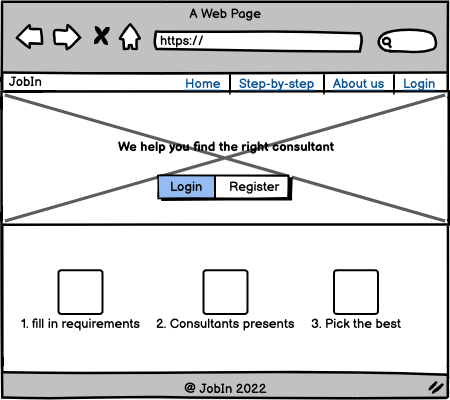
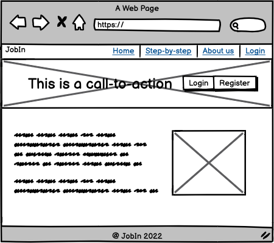
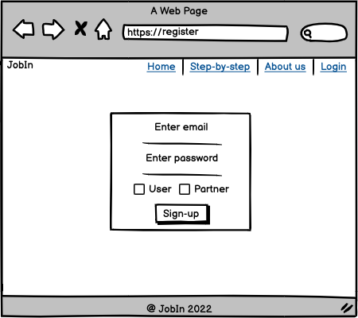
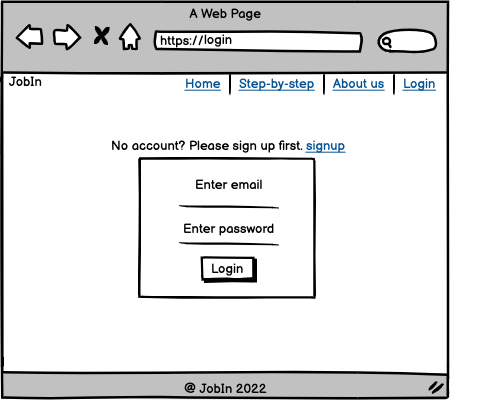
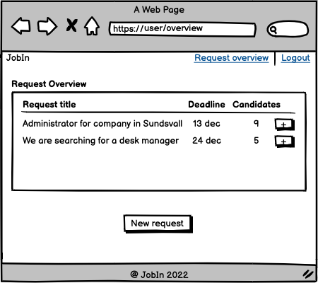
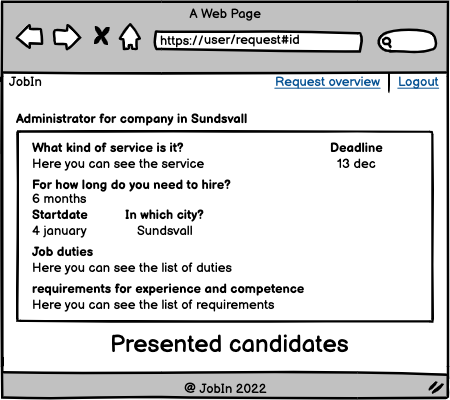
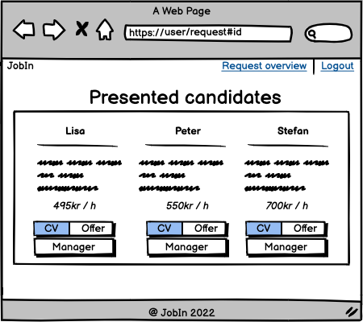
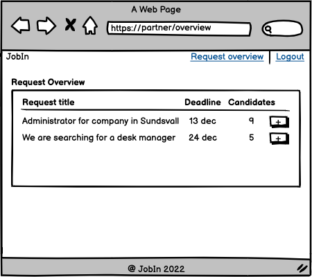
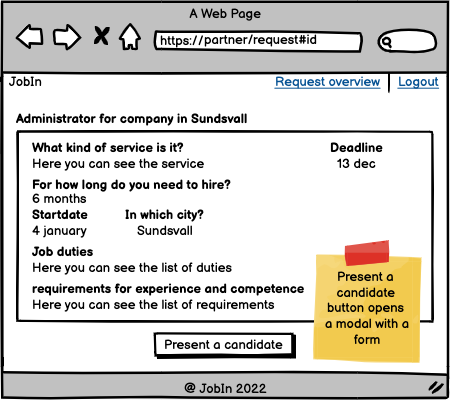
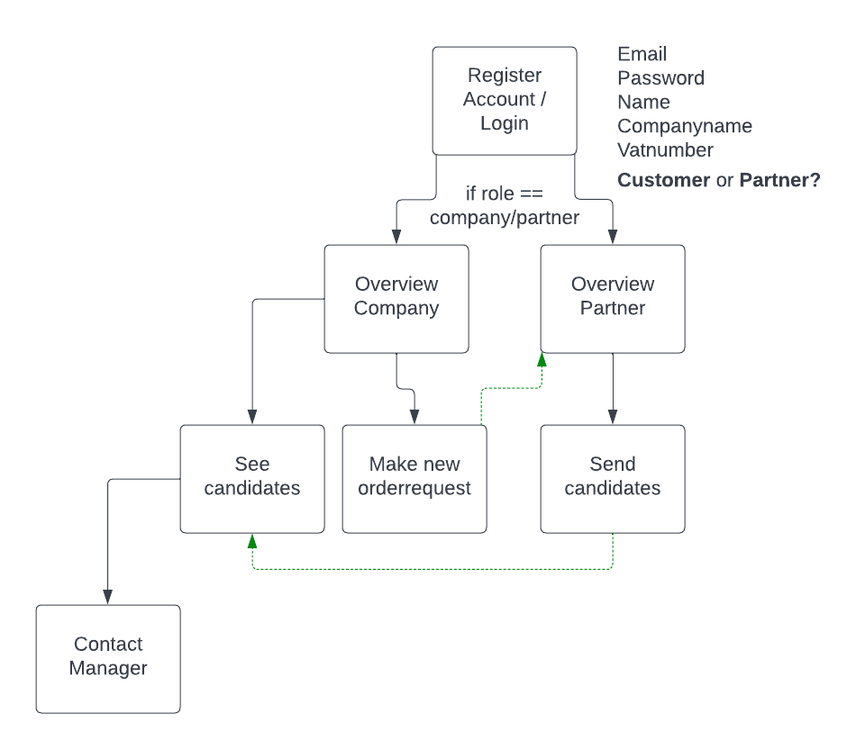

# Portfolio Project 4 - Fullstack Full-Stack Toolkit

## JObIn - Compare and find the best consultants for your company!

Finding the right consultant is more difficult than ever. That's why we've made it simple.

### This is how easily it works!
1. Simply create a request for the consultant you are looking for.
2. Our partners present the best consultants to you.
3. Compare consultants and choose the one that is best for your organization.

## Live Site
[Go to site](https://jobin-compare-consultants.herokuapp.com/) 

## Repository
[View repository](www.website.com)

---

## Catalouge
<li><a href="#target-group">Target Group</a></li>
<li><a href="#user-experince">UXD - User Experince Design</a></li>
<ul><li><a href="#storytelling">Storytelling</a></li>
<li><a href="#wireframe">Wireframe</a></li>
<ul><li><a href="w1">Homepage, Sign up, Log in</a></li>
<li><a href="#w2">Customer signed in</a></li>
<li><a href="#w3">Partner signed in</a></li></ul>
</ul>
<li><a href="#flowchart">Flowchart</a></li>
<li><a href="#user-stories">User Stories</a></li>

<li><a href="#rules">The Surface Plane</a></li>
<ul><li><a href="#base">Base</a></li>
<li><a href="#homepage">Homepage</a></li>
<li><a href="#signup">Signup</a></li>
<li><a href="#login">Login</a></li>
<li><a href="#customer-overview">Customer Overview</a></li>
<ul><li><a href="#customer-new">New Request</a></li>
<li><a href="#customer-edit">Edit Request</a></li>
<li><a href="#customer-delete">Delete Request</a></li>
<li><a href="#customer-candidate">See Candidates</a></li></ul>
<ul><li><a href="#partner-overview">Partner Overview</a></li>
<li><a href="#partner-new">Send Candidate</a></ul>
</ul>
<li><a href="#bugs">Bugs</a></li>
<ul><li><a href="#solved-bugs">Solved Bugs</a></li></ul>
<li><a href="#future-features">Future features</a></li>
<li><a href="#testing">Testing</a></li>
<li><a href="#technologies">Technologies</a></li>
<li><a href="#deployment">Deployment</a></li>
<li><a href="#credits">Credits</a></li>
<ul><li><a href="#code-issues">Issues with code</a></li>
<li><a href="#student-support">Student Support</a></li>
<li><a href="#code">Code</a></li></ul>
<li><a href="#acknowledgements">Acknowledgements</a></li></ul>

---

<h2 id="target-group">Target Group</h2>
The JobIn Applications have two target groups, customers and partners.
By focusing marketing on customers, we are confident that we will attract many partners to our application. consulting companies are always looking for new business opportunities and those opportunities are with us when customers post requests in our application

### Customers
The consultant industry have annual turnover of trillions of dollars worldwide. Companies in almost every country in the world is spending money in consulting hours, many of them with low satisfaction. jobin is an application for the thousands of companies that want to find the absolute best quality of the consultants they invest in, by comparing their options before making a decision.

### Partners
In Sweden, two new consulting companies are registered a week (statistics from 2021). There have never been so many companies fighting for the same customers. With our application, our partners can focus on their core business, hiring quality consultants, instead of having to spend time selling their services to clients. Whoever has the best consultant gets to deliver

<h2 id="flowchart">Flowchart</h2> 

## The story of Mats and The Factory
Mats is a hard-working manager at Svenska Industrigruppen AB.

He started his career there as a 16-year-old, then as a summer worker, and for 30 years has had various roles at the factory that refines metal for several large Swedish companies. Mats is fairly new in his role as a leader but enjoys it very much, and according to the company's latest employee surveys, he seems to be doing a really good job.

His biggest concern is when they need to hire new staff. Since it's a big decision and something that could cost the company a lot of money if it goes wrong, he feels some anxiety. The factory's production is very variable, and that makes it very difficult to plan how much staff is needed in production while it can change quickly, and in 14 days they will need five extra people to be able to produce at maximum level.

That evening, Mats remembers the nice guy who stopped by the factory a few weeks ago and picks up the business card to go to their website. He creates a user and enters the specifications for the resources he requires, then sends the request and goes to bed.

Already at lunch the next day, Mats has received two notices that there are candidates presented on the website, and he logs in. He looks at the candidates' CVs and the company's offer, the price is also reasonable for what he is looking for. He makes contact with responsible managers and books them in for an interview at the factory. 

Over the course of a few days, he receives more candidates on the website, and he chooses to meet a few more. Within 14 days, Mats has managed to find five consultants who enable the factory to deliver at the highest possible capacity. 
Mats is satisfied.

## User Stories

1. As a User I can register an account so that I can make a consultant request for my company.
Acceptance Criteria 1: I can register account with my email and own password.
Acceptance Criteria 2: I can fill in the details of my company as company name and vat number.

2. As a User I can make a consultant request so that partners know what I am searching for
Acceptance Criteria 1: The information that i can fill in is: Title, role, period, startdate, locality, duties, demands, wishes and deadline.
Acceptance Criteria 2: Startdate and deadline must be displayed with month, date, year.

3. As a User I can see all my requests in an overview so that I have control and know the status of the requests
Acceptance Criteria 1: When logging in i get redirected to the overview page.
Acceptance Criteria 2: In the overview i can see all my requests.
Acceptance Criteria 3: In every request i can see presented candidates.

4. As a User I can see when a partner has presented a consultant so that I can decide if I want to schedule an interview with the consultant
Acceptance Criteria 1: In the overview I can see how many candidates that have been presented for the specific request.
Acceptance Criteria 2: In request details I can see the presented candidate with name, price, summary, cv and offer.
Acceptance Criteria 3: I can also contact the manager by email.

5. As a User I can see contact information for the manager so that I can schedule an interview with the manager/consultant
Acceptance Criteria 1: When a candidate is presented I can contact the manager bu email for schedule an interview.

6. As a Partner I can register an account so that I can see consultant requests from companies
Acceptance Criteria 1: Register account with my own password.
Acceptance Criteria 2: Add details of my company with company name and vat number.

7. As a Partner I can see the details of the request so that I can present the right consultant
Acceptance Criteria 1: When I click the request i can see details about what the company is asking for.

8. As a Partner I can present a consultant with their CV, price, and conditions so that I can show the company that we have a solution for them
Acceptance Criteria 1: On the request details i can choose to present a candidate.
Acceptance Criteria 2: I can upload CV and offer in pdf format.
Acceptance Criteria 3: I can fill in the price for consultant by the hour.

9. As a Admin I can view details about users and partners so that I know who uses our tool
Acceptance Criteria 1: In adminpanel i can see a list of all registered accounts.
Acceptance Criteria 2: If i click on the account i can see if they are a user or partner.

10. As a Admin I can see a full list of ongoing requests so that I can contact new companies that may have these consultants
Acceptance Criteria 1: In adminpanel i can see a list of every request in the database.
Acceptance Criteria 2: I can see every detail of the request including contact information.

14. As a User/Partner I can see information about the website/tool so that I understand why i should register an account
Acceptance Criteria 1: When i go to the homepage I can see information about the service Immediately.
Acceptance Criteria 2: The homepage is user-friendly and i understand the content and information.

15. As a User I can Edit my requests so that the request displays the correct information in case of some changes are made
Acceptance Criteria 1: On the overview I can click on changing the request.
Acceptance Criteria 2: The change are made immediately and updates my request.

16. As a User I can delete my request so that partners do not spend time presenting candidates if we have already found what we are looking for
Acceptance Criteria 1: On the overview I can click on delete the request.
Acceptance Criteria 2: The change are made immediately and deletes my request.

### User Stories not done
11. As a User I can Add my company logo to my request so that companies can clearly see which company I represent.
Acceptance Criteria 1: As a User i can add my logo in my user profile and the logo will be displayed for companies in the request.

12. As a User I get a notice on my email when I have new candidates presented so that I have control and can act as fast as possible
Acceptance Criteria 1: When candidate is presented a notice is sent automatic to the users registered email.

13. As a Partner I get a notice on my email when a new request is added in my town so that I can act and start working on presenting a candidate
Acceptance Criteria 1: When a new new request exists i get a email with notice of that request.
Acceptance Criteria 2: Partner can choose which email the notice should go to.

## Wireframe

### User loged in

### Partner loged in

### Workflow

### Database schema
#### Order

### Bugs
* Rediricting to right page when user have logged in
* Login confirmation message do not dissapear when user have been logged in after signing up.
* Internal navbar links (Why Us and Step-by-step) is not accessable when user have logged in.
* Footer is not displayed on pages when the user don´t need to scroll.

#### Resolved Bugs
* Toggle collapse inside a for loop in template
* Navbar links on mobile
* Redirect logedin user based on user type
* Change of toggler color icon for Bootstrap navbar
I struggled a lot with changing color of the toggler icon inte the navbar. Then i found [This](https://www.folkstalk.com/2022/09/bootstrap-navbar-toggler-icon-color-with-code-examples.html) and understod that I needed to change the url for the icon.

### Technologies Used
https://www.simpleimageresizer.com/ - For making images smaller
https://pagespeed.web.dev/ - For checking Pagespeed Insights
https://miniwebtool.com/django-secret-key-generator/ - For generating Django secret key
https://cloudinary.com/ - For cloudstoring of pdf that is being saved to the database
https://techsini.com/multi-mockup/index.php - Multi Device Website Mockup Generator

### Sources
#### Images
[Homepage Partner]https://www.pexels.com/sv-se/foto/manniskor-barbar-dator-sitter-mote-4340139/
