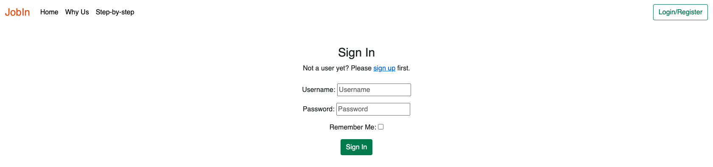
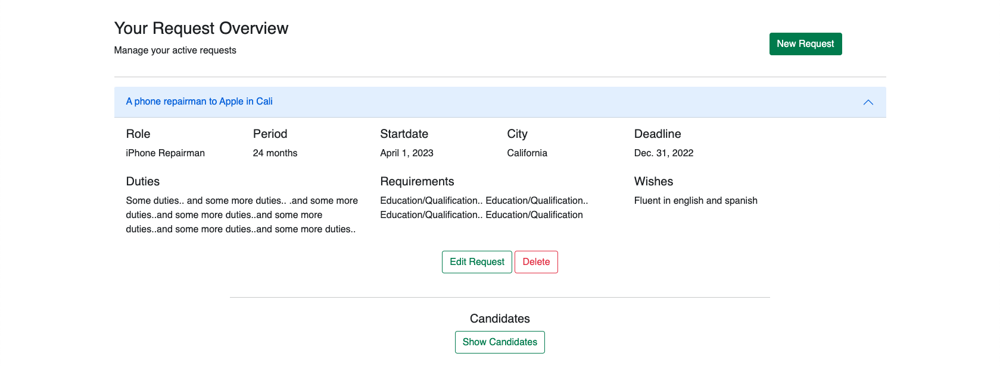
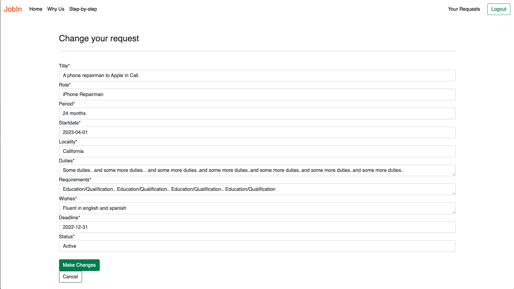

# Portfolio Project 4 - Full-Stack Toolkit

## JobIn - Compare and find the best consultants for your company!

Finding the right consultant is more difficult than ever. That's why we've made it simple.

### This is how easy it works!
1. Simply create a request for the consultant you are looking for.
2. Our partners present the best consultants to you.
3. Compare consultants and choose the one that is best for your organization.

## Live Site
[Go to application](https://jobin-compare-consultants.herokuapp.com/) 

## Repository
[View repository](https://github.com/williamtyn/jobin)

---

## Catalouge
<li><a href="#target-group">Target Group</a></li>
<li><a href="#user-experince">UXD - User Experince Design</a></li>
<ul><li><a href="#storytelling">Storytelling</a></li>
<li><a href="#wireframe">Wireframe</a></li>
<li><a href="#flowchart">Flowchart</a></li>
</ul>
<li><a href="#user-stories">User Stories</a></li>
<li><a href="#surface-plan">The Surface Plan</a></li>
<ul>
<li><a href="#base">Base</a></li>
<li><a href="#homepage">Homepage</a></li>
<li><a href="#signup">Signup</a></li>
<li><a href="#login">Login</a></li>
<li><a href="#customer-overview">Customer Overview</a></li>
<li><a href="#new-request">New Request</a></li>
<li><a href="#edit-request">Edit Request</a></li>
<li><a href="#delete-request">Delete Request</a></li>
<li><a href="#send-candidates">Send Candidates</a></ul>
<li><a href="#see-candidates">See Candidates</a></li>
<li><a href="#partner-overview">Partner Overview</a></li>
</ul>
<li><a href="#database-design">Database Design</a></ul>
<li><a href="#testing">Testing</a></li>
<li><a href="#deployment">Deployment</a></li>
<li><a href="#technologies-used">Technologies</a></li>
<li><a href="#credits">Credits</a></li>
<li><a href="#acknowledgements">Acknowledgements</a></li></ul>

---

<h2 id="target-group">Target Group</h2>
Jobin Application has two target groups, customers, and partners.
By focusing marketing on customers, we are confident that we will attract many partners to our application. Consulting companies are always looking for new business opportunities and those opportunities are with us when customers post requests in our application.

### Customers
The consultant industry has annual turnover of trillions of dollars worldwide. Companies in almost every country in the world are spending money on consulting hours, many of them with low satisfaction. Jobin is an application for the thousands of companies that want to find the absolute best quality of the consultants they invest in, by comparing their options before making a decision.

### Partners
In Sweden, two new consulting companies are registered a week (statistics from 2021). There have never been so many companies fighting for the same customers. With our application, our partners can focus on their core business, hiring quality consultants, instead of having to spend time selling their services to clients. Whoever has the best consultant gets to deliver

---

<h2 id="user-experince">UXD - User Experince Design</h2>
To better understand the customer journey i made a story about how a customer journey could look.

For base of the project i´ve made wireframes based on the user stories and the flowchart of customer/partner.

<h3 id="storytelling">The story of Mats and The Factory</h3>
Mats is a hard-working manager at Svenska Industrigruppen AB.

He started his career there as a 16-year-old, then as a summer worker, and for 30 years has had various roles at the factory that refines metal for several large Swedish companies. Mats is fairly new in his role as a leader but enjoys it very much, and according to the company's latest employee surveys, he seems to be doing a really good job.

His biggest concern is when they need to hire new staff. Since it's a big decision and something that could cost the company a lot of money if it goes wrong, he feels some anxiety. The factory's production is very variable, and that makes it very difficult to plan how much staff is needed in production while it can change quickly, and in 14 days they will need five extra people to be able to produce at maximum level.

That evening, Mats remembers the nice guy who stopped by the factory a few weeks ago and picks up the business card to go to their website. He creates a user and enters the specifications for the resources he requires, then sends the request and goes to bed.

Already at lunch the next day, Mats has received two notices that there are candidates presented on the website, and he logs in. He looks at the candidates' CVs and the company's offer, the price is also reasonable for what he is looking for. He makes contact with responsible managers and books them in for an interview at the factory. 

Over the course of a few days, he receives more candidates on the website, and he chooses to meet a few more. Within 14 days, Mats had managed to find five consultants who enabled the factory to deliver at the highest possible capacity.
Mats are satisfied.

<h3 id="wireframe">Wireframes</h3>

### User loged in

### Partner loged in

<h3 id="flowchart">Flowchart</h3> 
For a better understanding of how the flow of both a customer and partner should look, i´ve made a flowchart to describe the flow of a user from that they are visiting the application to that they have made the first request or sent their first candidate.

---

<h2 id="user-stories">User Stories</h2>

* As a User I can register an account so that I can make a consultant request for my company.
* As a User I can make a consultant request so that partners know what I am searching for.
* As a User I can see all my requests in an overview so that I have control and know the status of the requests.
* As a User I can see when a partner has presented a consultant so that I can decide if I want to schedule an interview with the consultant.
* As a User I can see contact information for the manager so that I can schedule an interview with the manager/consultant.
* As a User I can Edit my requests so that the request displays the correct information in case of some changes are made.
* As a User I can delete my request so that partners do not spend time presenting candidates if we have already found what we are looking for.

* As a User/Partner I can see information about the website/tool so that I understand why i should register an account.
* As a Partner I can register an account so that I can see consultant requests from companies.
* As a Partner I can see the details of the request so that I can present the right consultant.
* As a Partner I can present a consultant with their CV, price, and conditions so that I can show the company that we have a solution for them.

* As a Admin I can view details about users and partners so that I know who uses our tool.
* As a Admin I can see a full list of ongoing requests so that I can contact new companies that may have these consultants.

---

<h2 id="surface-plan">The Surface Plane</h2>

<h3 id="base">Base</h3>
To make the application as dynamic as possible, i want the navbar and footer to be the same in all of the application. Therefore, Django dynamic pages are used so the user always recognizes the default layout they're on.

Navbar

Footer

<h3 id="homepage">Homepage</h3>
A big goal is to highlight the advantages as early as possible so the user gets sold on why they should register and use our application. Two call-to action buttons are displayed in the hero image to encourage the user to do something; either sign up or read more.

The three biggest advantages of using our service are being displayed under the hero image. On desktop the user gets a hint about them and gets curious to read more.

When the user scrolls down, they can see some more advantages in combination with a sneakpeak of how the application looks on a laptop. Also here we have a call to action to encourage the user to do something.

So far we have focused on the user (Customer) and that's because the main market must be the customer to do requests in the application. We know that if we fill the database with a lot of requests, the partner will come to us to find new business opportunities.

After that we focus on the partner on the homepage and display a Call-to-action for the partner to register an account.

The step-by-step explains in details how the applications work and we want to show that to attract the user who want to understand more before making a decision.

And as a last intention to get the user to signup, we display a quote “If you always do what you've always done, you'll always get what you've always got.”.
Just to get the user to think in a different approach and signup to our application. We display a back-to-top button so the user don´t have to scroll up to register.

<h3 id="signup">Signup</h3>
The user is using the same signup page and chooses type of account, customer or partner, due to which type of account they will use.

<h3 id="login">Login</h3>
Its easy to login for returning user. Just fill in your username and password and you get logged in.

<h3 id="customer-overview">Customer Overview</h3>
When a user has signed up or logged in as a customer, they get redirected to the user/overview page. On this page they can find a call to action to make a new request. This is also the main page for the customer where they can see all their requests and also candidates on every request.

<h3 id="new-request">New Request</h3>
When the user clicks on the button to make a new request, they get redirected to a form to fill in the details about the request.

<h3 id="edit-request">Edit Request</h3>
From the overview the user can see the request and click on edit request if they need to make some changes on the request.

<h3 id="delete-request">Delete Request</h3>
On the overview, the customer can also choose to delete the request.

<h3 id="partner-overview">Partner Overview</h3>
When the partner has signed up or logged in, they get redirected to the main request overview where they can see all requests that's being active. If they click on the request, they can see details about that specific request.

<h3 id="send-candidates">Send Candidates</h3>
The partner can see information about the request and when they have a candidate that suits the request, they can present the candidate to the customer.

<h3 id="see-candidates">See Candidates</h3>
When the customer has presented the candidate, the user can see that candidate presented on their request. Compare with all the candidates that's being presented and choose which one suits their needs the best. If they want to schedule an interview, they can contact the manager by email.

---

<h2 id="database-design">Database Design</h2>
On this project postgresql is used with ElephantSQL

[Database Diagram](https://res.cloudinary.com/dpliee0fu/image/upload/v1669761371/Database_Planning_gzhnzg.pdf)

### Key Models

### User

* The user profile is connected to the User model created by Allauth on registration.
* The model is extended with AbstractUser to be able to save different user types with different permissions.
* Primary Key is the id which is genereated automatically when a user is created.

### Order

* The order model is related to the user model to see who is responsible for the order.
* If the user is deleted, the order also gets deleted so no orders are active for users that don´t exist.

### Candidate

* Candidates are related to their managers (Users) who "create" the candidate.
* Candidates are also related to the order in which managers present the candidate and link them together.
* Being linked to the order, the user can also get access to the Candidate information via the template.

---

<h2 id="testing">Testing</h2>
Link to the testing document.

[TESTING.md](https://github.com/williamtyn/jobin/blob/main/TESTING.md)

---

<h2 id="deployment">Deployment</h2>

The Code Institute student template was used to create this project.

[Code Institute Full Template](https://github.com/Code-Institute-Org/gitpod-full-template)

* Click the "Use This Template" button.
* Give your repository a name, and description if you wish.
* Click the Create Repository from Template to create your repository.
* Click the Gitpod button to create a gitpod workspace, this can take a few minutes.
* When working on project using Gitpod, please open the workspace from Gitpod, this will open your previous workspace rather than creating a new one. 
* Use the following commands to commit your work,
git add . - adds all modified files to a staging area.

git commit -m "A short message exlaining your commit" - commits all changes to a local repository.

git push - pushes all your commited changes to your Github repository.

 * Before making the first commit:
PLEASE MAKE SURE NEVER TO PUBLISH SECRET KEYS, ADD THE env.py TO A .gitignore TO AVOID PUSHING KEYS TO GITHUB.

### Heroku Deployment

1. Log into Heroku
2. Create a new app, choose a location closest to you
3. Search for Heroku Postgres from the resources tab and add to your project
4. Make sure to have dj_database_url and psycopg2 installed.

pip3 install dj_database_url
pip3 install psycopg2

5. Login to the Heroku CLI - heroku login -i
6. Run migrations on Heroku Postgres - heroku run python manage.py migrate
7. Create a superuser - python manage.py createsuperuser
8. Install gunicorn - pip3 install gunicorn
9. Create a requirements.txt file - pip3 freeze > requirements.txt
10. Create a Procfile (note the capital P), and add the following,

web: gunicorn jobin.wsgi

11. Disable Heroku from collecting static files

heroku config:set DISABLE_COLLECTSTATIC=1 --app jobin-compare-consultants

12. Add the hostname to project settings.py file

ALLOWED_HOSTS = ['jobin-compare-consultants.herokuapp.com', 'localhost']

13. Connect Heroku to you Github, by selecting Github as the deployment method and search for the github repository and pressing

connect

14. In Heroku, within settings, under config vars select

Reveal config vars

15. Add the following

DATABASE_URL = URL to the database
CLOUDINARY_URL = URL to cloudinary
SECRET_KEY = The secret key

16. Commit and push in your CLI

git add .
git commit -m "Initial commit"
git push

17. Go back to the Deploy tab and press

Deploy Branch

18. Your deployed site can be launched by clicking Open App from its page within Heroku.

*During production Heroku Postgresql was no longer availible and therefore DATABASE_URL in Heroku Config Vars was changed to the ElephantSQL Postgres url.*

---

<h2 id="technologies-used">Technologies Used</h2>

* [HTML](https://sv.wikipedia.org/wiki/HTML)
* [CSS](https://en.wikipedia.org/wiki/CSS)
* [Javascript](https://www.javascript.com/)
* [Python](https://www.python.org/)
* [Django](https://www.djangoproject.com/)
* [ElephantSQL](https://www.elephantsql.com/)
* [Bootstrap](https://getbootstrap.com/)
* [Heroku](https://id.heroku.com/login)
* [Cloudinary](https://cloudinary.com/)
* [Github](https://github.com/)
* [Gitpod](https://www.gitpod.io/)
* [Balsamiq](https://balsamiq.com/)
* [SimpleImageResizer](https://www.simpleimageresizer.com/)
* [Pagespeed](https://pagespeed.web.dev/)
* [Miniwebtool](https://miniwebtool.com/django-secret-key-generator/)
* [Techsini](https://techsini.com/multi-mockup/index.php)
* [Pexels](https://www.pexels.com)
* [Writer](https://writer.com/grammar-checker/)

---

<h2 id="credits">Credits</h2>

#### Code
* To help me get started with the project and understand the basics, i followed [Code Institute](https://codeinstitute.net/se/) and Matt´s Walktrough on "I Think therefore i Blog", big thanks for getting me started.

* Ed, Ger and Oisin, Tutors at [Code Institute](https://codeinstitute.net/se/) helped me solve some bugs in my code, big thanks.

#### Bootstrap
* Bootstrap has an amazing library and has helped me focus on the backend and save a lot of time with style, and layout on the frontend.

#### Django
* The generic views from [Django](https://www.djangoproject.com/) made my life much easier, also great documentation.

#### Issues with code
Most of the daily problems were solved thanks to [Stackoverflow](https://stackoverflow.com/) and [W3Schools](https://www.w3schools.com/).

<h2 id="acknowledgements">Acknowledgements</h2>

This website was completed as a Portfolio Project 4 for the Fullstack Diploma at [Code Institute](https://codeinstitute.net/se/). I want to thank my friend **Manne** for helping me understand some javascript functions.

The project is for educational purposes only and not for public consumption.

William Tynér, November 2022.
[LinkedIn](https://www.linkedin.com/in/williamtyner/)

