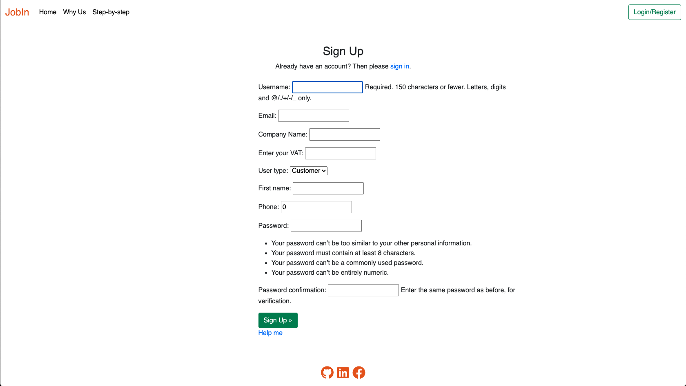
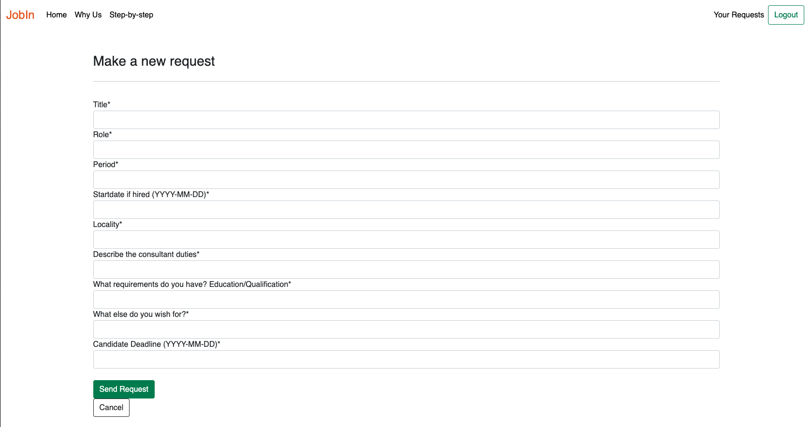
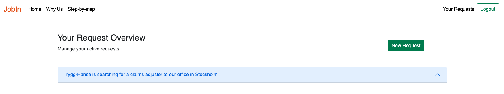
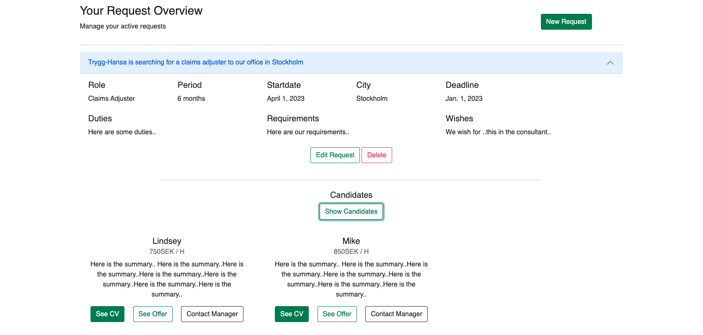
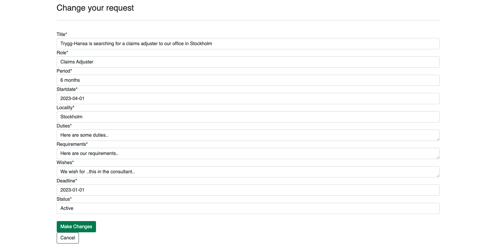
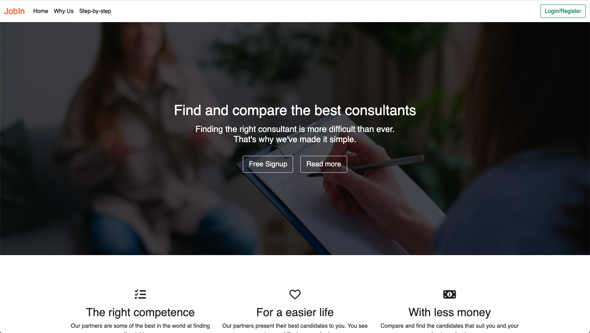
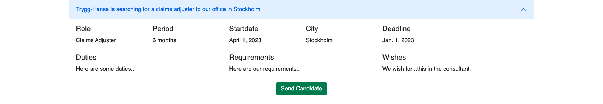
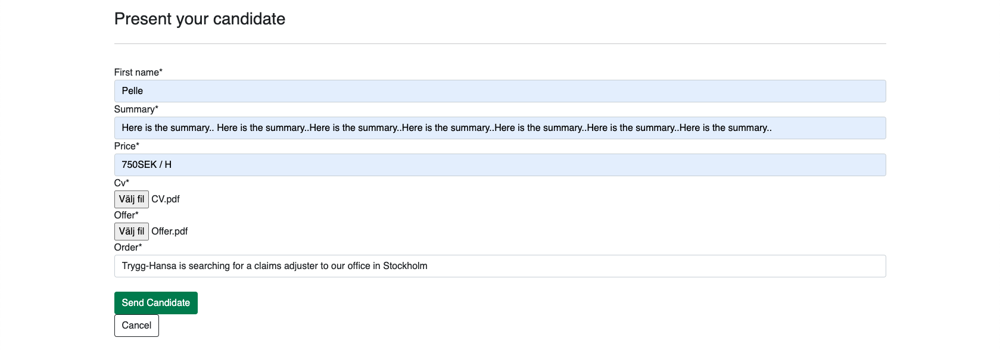

Back to README

---

## Testing Catalouge
<li><a href="#user-stories">User Stories Testing</a></li>
<ul>
<li><a href="#customer-testing">Customer Stories Testing</a></li>
<li><a href="#partner-testing">Partner Stories Testing</a></li>
<li><a href="#admin-testing">Admin Stories Testing</a></li>
</ul>
<li><a href="#manual-testing">Manual Testing</a></li>
<ul>
<li><a href="#navigation-bar">Navigation Bar</a></li>
<li><a href="#footer">Footer</a></li>
<li><a href="#homepage">Homepage</a></li>
<li><a href="#signup">Signup Page</a></li>
<li><a href="#login">Login Page</a></li>
<li><a href="#new-request">New Request Customer</a></li>
<li><a href="#request-overview">Request Overview</a></li>
<li><a href="#edit-request-customer">Edit Request Customer</a></li>
<li><a href="#delete-request-customer">Delete Request Customer</a></li>
<li><a href="#see-candidates">See Candidates as Customer</a></li>
<li><a href="#partner-overview">Partner Overview</a></li>
<li><a href="#send-candidate">Send Candidate</a></li>
<li><a href="#logout">Log out</a></li>
<li><a href="#adminpanel">Admin panel</a></li>
<li><a href="#authorization">Authorization</a></li>
<li><a href="#responsivness">Responsivness</a></li>
<li><a href="#browser-testing">Browser Testing</a></li>
</ul>
<li><a href="#validation">Validation</a></li>
<ul>
<li><a href="#validation">W3C HTML Validator</a></li>
<li><a href="#validation">W3C CSS Validator</a></li>
<li><a href="#validation">JSHint Javascript Validator</a></li>
<li><a href="#validation">PEP8 Python Validator</a></li>
</ul>
<li><a href="#lighthouse">Lighthouse Testing</a></li>
<li><a href="#bugs">Bugs</a></li>
<ul>
<li><a href="#solved-bugs">Solved Bugs</a></li>
</ul>

---

<h2 id="user-stories">User Stories Testing</h2>

<h3 id="customer-testing">Customer Stories Testing</h3>
<ul>
<li><a href="#one">As a User I can register an account so that I can make a consultant request for my company.</a></li>
<li><a href="#two">As a User I can make a consultant request so that partners know what I am searching for.</a></li>
<li><a href="#three">As a User I can see all my requests in an overview so that I have control and know the status of the requests.</a></li>
<li><a href="#four">As a User I can see when a partner has presented a consultant so that I can decide if I want to schedule an interview with the consultant.</a></li>
<li><a href="#five">As a User I can see contact information for the manager so that I can schedule an interview with the manager/consultant.</a></li>
<li><a href="#fifteen">As a User I can Edit my requests so that the request displays the correct information in case of some changes are made.</a></li>
<li><a href="#sixteen">As a User I can delete my request so that partners do not spend time presenting candidates if we have already found what we are looking for.</a></li>
</ul>

<h3 id="#partner-testing">Partner Testing</h3>
<ul>
<li><a href="#fourteen">As a User/Partner I can see information about the website/tool so that I understand why i should register an account.</a></li>
<li><a href="#six">As a Partner I can register an account so that I can see consultant requests from companies.</a></li>
<li><a href="#seven">As a Partner I can see the details of the request so that I can present the right consultant.</a></li>
<li><a href="#eigth">As a Partner I can present a consultant with their CV, price, and conditions so that I can show the company that we have a solution for them.</a></li>
</ul>

<h3 id="#admin-testing">Admin Testing</h3>
<ul>
<li><a href="#nine">As a Admin I can view details about users and partners so that I know who uses our tool.</a></li>
<li><a href="#ten">As a Admin I can see a full list of ongoing requests so that I can contact new companies that may have these consultants.</a></li>
</ul>

---

## User/Customer Stories Testing

<h3 id="one">As a User I can register an account so that I can make a consultant request for my company.</h3>
Acceptance Criteria 1: I can register account with my email and own password.

Acceptance Criteria 2: I can fill in the details of my company as company name and vat number.

On the signup page, the user can sign up and add their own unique email and password. They can also fill in the details of their company, such as the company name and VAT number.

<h3 id="two">As a User I can make a consultant request so that partners know what I am searching for.</h3>
Acceptance Criteria 1: The information that i can fill in is: Title, role, period, startdate, locality, duties, demands, wishes and deadline.

Acceptance Criteria 2: Startdate and deadline must be displayed with month, date, year.

When the user makes a new request, they can fill in the information in acceptance criteria 1. Duties are named requirements due to a clearer understanding.
The start and end dates are in the MM, DD, and YYYY formats. 

<h3 id="three">As a User I can see all my requests in an overview so that I have control and know the status of the requests.</h3>
Acceptance Criteria 1: When logging in i get redirected to the overview page.

Acceptance Criteria 2: In the overview i can see all my requests.

Acceptance Criteria 3: In every request i can see presented candidates.

When the user has signed in, they get redirected to their overview page, where they can find all their requests presented in a list or collapse.
If the user clicks on the request, details of the request are presented, along with a toggle button for candidates. When they press the candidate button, all candidates that have been presented are shown as cards for the user. If the list of presented candidates is zero, a text saying "You do not have any presented candidates on this request" is shown.

<h3 id="four">As a User I can see when a partner has presented a consultant so that I can decide if I want to schedule an interview with the consultant.</h3>
Acceptance Criteria 1: In the overview I can see how many candidates that have been presented for the specific request.

Acceptance Criteria 2: In request details I can see the presented candidate with name, price, summary, cv and offer.

Acceptance Criteria 3: I can also contact the manager by email.

When the user clicks on the button "Show Candidates," they see all candidates that have been presented for that specific request. The user sees "Name," "Price," and "Summary." When they click the buttons for CV and Offer, a new page opens, and they can see the document there.
The button "Contact Manager" opens their mail client with the manager's email prefilled.

<h3 id="five">As a User I can see contact information for the manager so that I can schedule an interview with the manager/consultant.</h3>
Acceptance Criteria 1: When a candidate is presented I can contact the manager bu email for schedule an interview.

As described above, the manager's email is being prefilled in the user's mail client when clicking the button "Contact Manager."

<h3 id="fifteen">As a User I can Edit my requests so that the request displays the correct information in case of some changes are made.</h3>
Acceptance Criteria 1: On the overview I can click on changing the request.

Acceptance Criteria 2: The change are made immediately and updates my request.

In the user overview, the user can see two buttons for editing or deleting their request. When the user clicks on "Edit request," a form with the prefilled request information is displayed. The user can make changes to their request, and those changes take effect immediately.

<h3 id="sixteen">As a User I can delete my request so that partners do not spend time presenting candidates if we have already found what we are looking for.</h3>
Acceptance Criteria 1: On the overview I can click on delete the request.

Acceptance Criteria 2: The change are made immediately and deletes my request.

In the overview, the user can see the delete button. When a button is clicked, the user is redirected to a confirmation template.

## Partner Stories Testing

<h3 id="fourteen">As a User/Partner I can see information about the website/tool so that I understand why i should register an account.</h3>
Acceptance Criteria 1: When i go to the homepage I can see information about the service immediately.

Acceptance Criteria 2: The homepage is user-friendly and i understand the content and information.

A page visitor can see the application's purpose immediately, and with one click, they can see step-by-step how the application works. For more information about the user experience, please see the section <a href="#manual-testing">Manual Testing</a>.

<h3 id="six">As a Partner I can register an account so that I can see consultant requests from companies.</h3>
Acceptance Criteria 1: Register account with my own password.

Acceptance Criteria 2: Add details of my company with company name and vat number.

In the signup page, the partner creates their account but chooses "Partner instead of "Customer" as the user type. The partner fills in details with the company name and VAT number.

<h3 id="seven">As a Partner I can see the details of the request so that I can present the right consultant.</h3>
Acceptance Criteria 1: When I click the request i can see details about what the company is asking for.

When the partner clicks on the request title, all details about that specific request are displayed for the partner.

<h3 id="eight">As a Partner I can present a consultant with their CV, price, and conditions so that I can show the company that we have a solution for them.</h3>
Acceptance Criteria 1: On the request details i can choose to present a candidate.

Acceptance Criteria 2: I can upload CV and offer in pdf format.

Acceptance Criteria 3: I can fill in the price for consultant by the hour.

When the partner sees details about the request, they also see the button for the present candidate.

When the partner has clicked the button "send candidate," a form is displayed for them. They upload the candidates' CVs and provide them in PDF format in the form. They also present the price for hiring this consultant.

<h2 id="admin-testing">Admin Stories Testing</h2>

<h3 id="nine">As a Admin I can view details about users and partners so that I know who uses our tool.</h3>
Acceptance Criteria 1: In adminpanel i can see a list of all registered accounts.

Acceptance Criteria 2: If i click on the account i can see if they are a user or partner.

In the admin panel, the admin can see a list of every registered user. When admins click on the user, all information about the user is displayed, including whether the user is a customer or partner.
Due to sensitive information, no image of the admin panel is displayed in the readme.

<h3 id="ten">As a Admin I can see a full list of ongoing requests so that I can contact new companies that may have these consultants.</h3>
Acceptance Criteria 1: In adminpanel i can see a list of every request in the database.

Acceptance Criteria 2: I can see every detail of the request including contact information.

In the admin panel, the admin can see a list of every registered request in the database and details about the request.
Due to sensitive information, no image of the admin panel is displayed in the readme.

### User Stories (could) that are not done
11. As a User I can Add my company logo to my request so that companies can clearly see which company I represent.
Acceptance Criteria 1: As a User i can add my logo in my user profile and the logo will be displayed for companies in the request.

12. As a User I get a notice on my email when I have new candidates presented so that I have control and can act as fast as possible
Acceptance Criteria 1: When candidate is presented a notice is sent automatic to the users registered email.

13. As a Partner I get a notice on my email when a new request is added in my town so that I can act and start working on presenting a candidate
Acceptance Criteria 1: When a new new request exists i get a email with notice of that request.
Acceptance Criteria 2: Partner can choose which email the notice should go to.

---

<h2 id="manual-testing">Manual Testing</h2>

<h3 id="navigation">Navigation Bar</h3>

* All links correctly redirect to the correct pages for visitors.
* Navbar is fully responsive on small/medium/large devices.
* Customer sees correct link "Your overview" when logged in.
* Partner sees correct link "Overview" when logged in.
* Navbar collapse works on smaller devices.
* Why Us and Step-by-step is internal anchor links to the homepage and are not available when the user is not on the homepage, see bugs in Readme.

<h3 id="footer">Footer</h3>

* All icon links work correctly.
* All links open in a new page.
* The footer appears at the end of the page with javascript.
* Back to top button being displayed on scroll.
* Back to top button takes visitor back to top.
* Footer are not being displayed on pages when user don´t need to scroll, see bugs in Readme.

<h3 id="homepage">Homepage</h3>

* All buttons work and links correctly.
* Icons are being displayed correctly.
* Images are displayed correctly.
* Good contrast between text/images/buttons.

<h3 id="signup">Signup page</h3>

* Username, Email, Company Name, VAT and password are required as expected.
* First Name and Phone are optional.
* Help modal works as expected.
* User get redirected to the right page after based on user type.
* Messages to user don't disappear when user has signed up; need to manually close the message, see bugs in Readme.
* Message of verification email being sent is displayed after signup; see bugs in Readme.

<h3 id="login">Login page</h3>

* Form works as expected with username and password.
* User gets redirected to the right page after login.
* Message of login confirmation being displayed and disappear as expected.

<h3 id="new-request">New Request Customer</h3>

* New Request button is linked correctly.
* All fields in the new request form are required.
* Send request button redirects back to overview after form is valid and data sent.
* Confirmation message of request successfully submitted is displayed.
* Cancel button for the new request is linked and redirecting customer back to overview.
* The request is shown in the Overview to display for all partners.

<h3 id="request-overview">Request Overview</h3>

* Showing all request with title in the collapse.
* The toggle for collapse works as expected.
* All data from the model being displayed.

<h3 id="edit-request-customer">Edit Request Customer</h3>

* Edit button is linked and redirects customer to the right url for editing request.
* The form for editing is prefilled with the right data.
* Messages that changes have been made are displayed and disappear.
* Data is changed in the right form field when changes are made.
* Cancel button in edit request works and redirect to overview.
* If customer makes request inactive its removed from Partner Overview as expected.

<h3 id="delete-request-customer">Delete Request Customer</h3>

* Delete button is displayed in request details.
* When button is pressed, customer is redirected to the right url to delete the request.
* Customer is redirected to confirm delete page.
* Cancel button is linked correctly.
* Message is displayed to customer after confirmation.
* Request data is removed from the database.

<h3 id="see-candidates">See Candidates as Customer</h3>

* Show Candidates toggle button works as expected.
* Message is displayed correctly if there are no candidates presented.
* Candidate is presented as card with name, price, summary.
* Button to see CV works as expected.
* Button to see Offer works as expected.
* Contact Manager button opens the mailclient and email to manager is displayed.

<h3 id="partner-overview">Partner Overview</h3>

* All active orders are displayed in the overview.
* Toggle the collapse works as expected.
* All details are displayed in the right order in the collapse details.
* Send candidate button is being displayed as expected.
* Send candidate button is linked correctly.

<h3 id="send-candidate">Send Candidate</h3>

* Every field form is required as expected.
* Partner need to choose which order the candidate should be presented on (works now, but with many orders this should be changed to prefilled).
* Message being displayed and disappear after confirmation of sending candidate.
* Cancel button works as expected.
* The candidate is displayed on the right request for customer.

<h3 id="logout">Log out</h3>

* Cancel button for logout works as expected.
* Message is displayed after log-out confirmation.

<h3 id="adminpanel">Admin panel</h3>

* Admin can see a list of all Candidates with details.
* Admin has access to all Orders with details.
* Admin has access to all Users with details.

<h3 id="authorization">Authorization</h3>

This applies to every browser. User is authenticated in the browser when they log in.
* User gets redirected to login page if not authenticated for /new//order.
* User gets redirected to login page if not authenticated for /edit/order.
* User gets redirected to login page if not authenticated for /delete/order.
* User gets redirected to login page if not authenticated for /overview.
* User gets redirected to login page if not authenticated for /user/overview.
* User gets redirected to login page if not authenticated for /new/candidate.

* Message "You need to be a customer to have access to this page" being displayed to partner if they try to access /user/overview.
* Message "You need to be a customer to have access to this page" being displayed to partner if they try to access /new/order.
* Message "You need to be a partner to have access to this page" being displayed to customer if they try to access /overview.
* Message "You need to be a partner to have access to this page" being displayed to customer if they try to access /new/candidate.
* Message "This is not your request and you do not have access to this page" being displayed if customer/partner try to access /edit or /delete a request that is not theirs.

* SQL Injection has been tried to access database information or destroy database without any success.

<h3 id="responsivness">Responsivness</h3>

Chrome dev tools were used throughout the development of the project to test responsiveness. Responsiveness was tested using Dev Tools to emulate the following devices.

* Iphone 5
* Iphone 6/7/8
* Iphone 6/7/8 Plus
* Iphone X
* Ipad
* Ipad Pro

<h3 id="browser-testing">Browser Testing</h3>

During development, testing was mainly done solely using Google Chrome.

In production the site has been tested on the following browsers.

* Firefox
* Safari
* Opera

---

<h2 id="validation">Validation</h2>

### [W3C HTML Validator](https://validator.w3.org/)
* 0 Errors
* 0 Warnings

### [W3C CSS Validator](https://jigsaw.w3.org/css-validator/)
* 0 Errors
* 0 Warnings

### [JSHint Javascript Validator](https://jshint.com/)
* 0 Errors
* 0 Warnings
*One undefined variable (Bootstrap) - Being used for messages*

### PEP8 Python Validator
* 0 Errors
* 0 Warnings

The python validator extension was used to test Python for Pep8 compliance with its built-in linting too.

* A lot of the Python errors were fixed during development.
Any errors related to files that were auto generated by Django were left untouched.
* In settings AUTH_PASSWORD_VALIDATORS, STATICFILES_STORAGE due to implementation with help from Hello Django episode on Code Institute. # noqa is added to override the error.
* Migration Files
* ./manage.py

<h3 id="lighthouse">Lighthouse Testing</h3>

#### On desktop for homepage

#### On mobile for homepage

---

<h2 id="bugs">Bugs</h2>

* Login confirmation message do not disappear when user has been logged in after signing up.
* Internal navbar links (Why Us and Step-by-step) are not accessible when user has logged in.
* Footer is not displayed on pages when the user don´t need to scroll. The footer only appears on pages where users need to scroll.

<h3 id="solved-bugs">Solved Bugs</h3>

* Redirecting to right page when user has logged in
I had i main issue that user was not redirected to the right page based on the user type. I was able to solve that issue with a custom view and defining the get user type, the redirected to the right url based on user type.

* Toggle collapse inside a for loop in template
A bootstrap collapse is used for displaying both the order and candidate for the customer. There was a main issue that every collapse opened when i toggled it. I solved it with some custom javascript code to target the nearest element when the user toggled.

* Navbar links on mobile
The navbar is separated into different lists based on if they are authenticated and when logged in, which user type. All logged in links are pushed to the right and first i did that with position fixed. Therefore the internal (logged in) links what not displaying in navbar on smaller devices.
I solved that with some custom CSS so the position is fixed down to 991px when the collapse navbar appears, then the position fixed is removed.

* Change of toggler color icon for Bootstrap navbar
I struggled a lot with changing the color of the toggler icon into the navbar. Then i found [This](https://www.folkstalk.com/2022/09/bootstrap-navbar-toggler-icon-color-with-code-examples.html) and understood that I needed to change the url for the icon.

---
